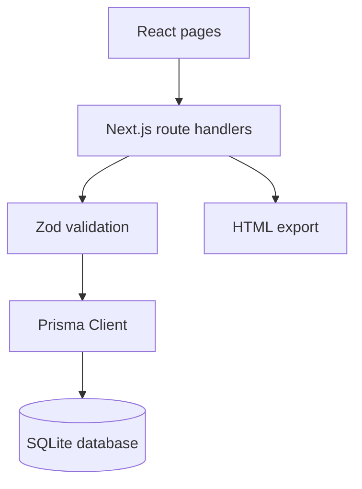
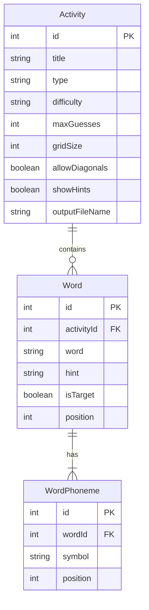

# Phoneme Activity Builder — Assessment 2

A full-stack Next.js application for Speech Pathology teachers to create, store,
manage and export phoneme-based Wordle and Word Search classroom activities.
Assessment 2 extends the Assessment 1 interface with a Prisma/SQLite data layer,
REST-style route handlers, validation, error handling and Docker support.

**Author:** Tanish Sudan<br>
**Student number:** 22407274<br>
**Repository:** https://github.com/LagzGit/Phoneme-Wordle

## Assessment requirements implemented

- Next.js App Router project originally created with the `create-next-app` workflow.
- Backend route handlers for activities, words, exports and health monitoring.
- Prisma schema with `Activity`, `Word` and `WordPhoneme` models.
- SQLite persistence with three seeded activity configurations.
- Create, read, update and delete operations for activity settings and words.
- Ordered phoneme storage where multi-character values such as `tʃ`, `dʒ` and
  `iː` occupy one record rather than being split into characters.
- Wordle and Word Search previews populated by data retrieved from the API.
- Downloadable standalone HTML generated by the backend from the selected record.
- Zod validation and consistent JSON error responses.
- Database-aware `GET /health` endpoint returning `200 OK` when healthy.
- Multi-stage Dockerfile and Docker Compose configuration with persisted data.
- Automated checks for phoneme parsing, validation, puzzle generation and export.

## Architecture

The browser communicates with Next.js route handlers using HTTP. Route handlers
validate incoming JSON with Zod before calling the data-service functions. Prisma
maps those operations to SQLite. Both activity builders read saved records from
the same API. The export endpoint also loads the chosen record from SQLite, then
produces a dependency-free HTML document.



### Database schema



An activity can contain multiple ordered words. A Wordle activity is restricted
to one target word, while a Word Search can contain multiple words. Each word has
multiple ordered phoneme records. `WordPhoneme.symbol` uses a database text field,
so a phoneme can contain one or several Unicode characters. The `position` field
preserves pronunciation order.

Deleting an activity cascades to its words and phonemes. A compound unique index
prevents the same English word from being stored twice in one activity, and a
second compound index prevents two phonemes from occupying the same position.

## Local setup

Node.js 24 is recommended because it matches the included Docker image.

```bash
npm install
npm run db:setup
npm run dev
```

Open http://localhost:3000. The setup command creates the SQLite tables and
reseeds three demonstrations. Because reseeding replaces existing development
records, it should be run before the demonstration rather than after entering
content that must be kept.

Other useful commands:

```bash
npm run lint
npm test
npm run build
npm run db:generate
npm run db:seed
```

The default local database is `prisma/dev.db`. `.env.example` documents the local
connection variable. The application also supplies a safe fallback connection so
the included seeded database can run immediately.

## Pages

| Route | Purpose |
| --- | --- |
| `/` | Project overview and links to the stored-data workflow. |
| `/activities` | Teacher CRUD interface for activity settings, words and phonemes. |
| `/wordle` | Select and preview a saved Wordle configuration. |
| `/wordsearch` | Select and preview a saved Word Search configuration. |
| `/settings` | Light/dark preference stored in a cookie. |
| `/about` | Project explanation, author details and references. |
| `/health` | Database-aware health response used for demonstration and Docker. |

## Backend API

| Method and route | Operation |
| --- | --- |
| `GET /api/activities` | Read all activities and nested words/phonemes. |
| `GET /api/activities?type=WORDLE` | Read activities filtered by type. |
| `POST /api/activities` | Create a saved activity configuration. |
| `GET /api/activities/:id` | Read one complete configuration. |
| `PATCH /api/activities/:id` | Update settings and output metadata. |
| `DELETE /api/activities/:id` | Delete an activity and its related data. |
| `GET /api/activities/:id/words` | Read the activity's words. |
| `POST /api/activities/:id/words` | Create a word with ordered phonemes. |
| `PATCH /api/words/:id` | Update a word, hint or complete phoneme sequence. |
| `DELETE /api/words/:id` | Delete one word. |
| `GET /api/activities/:id/export` | Generate HTML from the stored record. |
| `GET /health` | Check server and database availability. |

Successful API responses use a `data` property. Invalid requests return a clear
message, a stable error code and field-level validation details. Missing records
return `404`, duplicate words return `409`, incomplete activity exports return
`422`, unexpected server failures return `500`, and database health failures
return `503`.

## Validation and error handling

The backend is the source of truth for validation; HTML form constraints only
provide earlier feedback. Activity types are restricted to `WORDLE` or
`WORD_SEARCH`, and difficulties are `EASY`, `MEDIUM` or `HARD`. Titles, hints,
instructions, numeric ranges and safe output filenames have length or format
limits. Words accept letters, spaces, apostrophes and hyphens.

Phoneme input is submitted as an array. The management page splits only on
commas, which preserves a multi-character IPA unit. Every value is checked
against the supported HCE keyboard before being stored. Empty arrays, unknown
symbols and malformed JSON receive a readable `400` response. Generated content
is escaped before being inserted into HTML or JavaScript.

## Docker

Build and start the application with:

```bash
docker compose up --build
```

Then open http://localhost:3000 and http://localhost:3000/health. Docker Compose
mounts a named volume at `/app/data`, so CRUD changes remain after the container
is stopped and started. On the first run, the entrypoint copies the seeded
database into that volume. The container runs as the non-root `node` user and
includes a health check that calls `/health`.

To stop the container:

```bash
docker compose down
```

Do not add `-v` unless the stored Docker data should also be removed.

## Suggested video demonstration

1. Show face and student ID within the first 30 seconds.
2. Open `/health`, then show the Network panel or response status as `200 OK`.
3. Open Saved Activities and explain the three related database models.
4. Create a Word Search activity and add a word using `tʃ, ɪ, n`.
5. Read the saved row, edit its hint or phonemes, and save the update.
6. Open the activity in the builder and show that the stored data appears.
7. Generate and open the standalone HTML file.
8. Return to Saved Activities and delete the demonstration word or activity.
9. Repeat the stored-data generation briefly for Wordle.
10. Show `docker compose up --build`, the running container and the website.
11. Show the Prisma schema, API route folders, validation file and commit history.

## References

Cox, F. (2008). Vowel transcription systems: An Australian perspective.
*International Journal of Speech-Language Pathology, 10*(5), 327–333.
https://doi.org/10.1080/17549500701855133

Docker. (n.d.). *Containerize a Next.js application*. Retrieved September 12,
2026, from https://docs.docker.com/guides/nextjs/

Harrington, J., Cox, F., & Evans, Z. (1997). An acoustic phonetic study of broad,
general, and cultivated Australian English vowels. *Australian Journal of
Linguistics, 17*(2), 155–184. https://doi.org/10.1080/07268609708599550

Prisma Data, Inc. (n.d.). *CRUD*. Prisma Documentation. Retrieved September 12,
2026, from https://www.prisma.io/docs/orm/prisma-client/queries/crud

Prisma Data, Inc. (n.d.). *SQLite database connector*. Prisma Documentation.
Retrieved September 12, 2026, from
https://www.prisma.io/docs/orm/core-concepts/supported-databases/sqlite

React. (n.d.). *Thinking in React*. Retrieved September 12, 2026, from
https://react.dev/learn/thinking-in-react

Vercel. (2026, February 27). *Route handlers*. Next.js Docs.
https://nextjs.org/docs/app/getting-started/route-handlers

World Wide Web Consortium. (2024, December 12). *Web Content Accessibility
Guidelines (WCAG) 2.2*. https://www.w3.org/TR/WCAG22/
